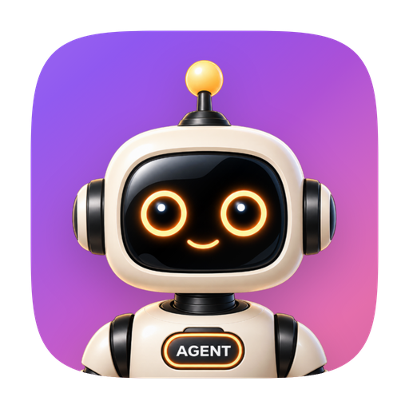

<p align="center">
  
</p>

<h1 align="center">OPC Agent</h1>

<p align="center">
  A local-first, Pi-powered AI agent workspace for Desktop, WebUI, and CLI.
</p>

<p align="center">
  <a href="https://github.com/iBigQiang/OpcAgent/releases/latest"></a>
  <a href="./LICENSE"></a>
  <a href="https://bun.sh"></a>
  <a href="https://www.electronjs.org"></a>
</p>

<p align="center">
  <a href="https://github.com/iBigQiang/OpcAgent/releases/latest">Download</a> ·
  <a href="./docs/README.md">Documentation</a> ·
  <a href="./docs/zh/README.md">中文文档</a> ·
  <a href="#quick-start">Quick Start</a> ·
  <a href="https://github.com/iBigQiang/OpcAgent/discussions">Community</a>
</p>
OPC Agent is an open-source AI agent workspace for people who want local control over their work,
model connections, and data. The same Pi-powered runtime serves the Electron desktop app, WebUI,
headless server, and CLI. It combines persistent workspaces and sessions with model flexibility,
Skills, browser and document tools, Sources, projects, automations, and optional messaging channels.

Application data stays under `~/.opcagent` by default. API keys and tokens are kept in a local
AES-256-GCM encrypted credential store rather than written into configuration or session files.

## Current release

Version **0.1.4** adds editable endpoint protocols for AgentRouter and custom providers. Users can
select OpenAI Chat Completions, OpenAI Responses, Anthropic Messages, or Google Gemini, paste a root
URL, versioned Base URL, or known full request URL, and preview the effective request path before
saving. AgentRouter now defaults to OpenAI Chat Completions and includes `gpt-5.6-sol`.

See the [changelog](./CHANGELOG.md) and [GitHub Releases](https://github.com/iBigQiang/OpcAgent/releases)
for complete release notes and downloads.

## Features

- **Local-first workspaces and sessions** — keep configuration, sessions, files, attachments, and
  workspace history on your machine; search, flag, archive, import, export, and branch sessions.
- **Flexible AI connections** — use ChatGPT Plus, Claude Pro/Max, provider API keys, AgentRouter,
  AnyRouter, Ollama, and custom OpenAI Chat, OpenAI Responses, Anthropic Messages, or Gemini endpoints.
- **Desktop, WebUI, and CLI** — use the full Electron application, connect a browser renderer to the
  headless server, or automate workflows through the RPC command-line client.
- **Agent workflows** — use plans, Skills, projects, scheduled or event automations, follow-ups, and
  multiple application windows.
- **Sources and tools** — connect API, MCP, or local-folder Sources; browse the web; work with
  attachments; render Markdown and code; and inspect or transform common document formats.
- **Messaging integrations** — connect Telegram, WhatsApp, or Lark / Feishu to workspace sessions,
  with pairing, owner access, allow lists, and workspace-scoped bindings.
- **Explicit control** — configure permission modes, thinking depth, network proxy settings, themes,
  input behavior, and English or Simplified Chinese interface language.
- **Persistent updates** — application upgrades preserve `~/.opcagent` configuration and history;
  interactive Windows uninstall lets the user choose whether to retain or remove that data.

## Downloads

Prebuilt Desktop packages are published on [GitHub Releases](https://github.com/iBigQiang/OpcAgent/releases/latest):

| Platform | Package | Trust note |
| --- | --- | --- |
| Windows x64 | NSIS installer: `OPC-Agent-<version>-x64.exe` | Unsigned builds may trigger Microsoft Defender SmartScreen |
| macOS Apple Silicon / Intel | DMG and ZIP | Ad-hoc builds may trigger Gatekeeper unless a signed release is available |
| Linux x64 | AppImage | Download, mark executable, and run |

Release pages also contain checksums, update manifests, headless-server archives, and the Bun CLI
bundle. Verify downloaded files against the published `SHA256SUMS` before installation.

## Quick start

### Prerequisites

- [Bun](https://bun.sh) 1.3.14 or later
- Node.js 18 or later
- Git
- Python 3.12 and [`uv`](https://docs.astral.sh/uv/) for the complete document-tool test suite

### Run the Desktop app from source

```bash
git clone https://github.com/iBigQiang/OpcAgent.git
cd OpcAgent
bun install --frozen-lockfile
bun run electron:dev
```

On Windows, install Git for Windows and configure the Git Bash path in OPC Agent if it is not found
automatically. The default application-data root is `%USERPROFILE%\.opcagent`; on macOS and Linux it
is `~/.opcagent`. Set `CONFIG_DIR` only when you intentionally need an isolated development or test
profile.

### Common commands

| Command | Description |
| --- | --- |
| `bun run electron:dev` | Start the Electron development environment |
| `bun run electron:start` | Build and launch Electron once |
| `bun run server:prod` | Build and start the headless server with WebUI |
| `bun run cli:build` | Build the CLI bundle |
| `bun run test` | Run unit and isolated tests |
| `bun run typecheck:all` | Type-check every workspace package and application |
| `bun run validate:ci` | Run the full type, test, document-tool, and localization gate |
| `bun run electron:dist:win` | Build the Windows installer locally |

More commands and environment variables are documented in the
[development guide](./docs/development.md).

## Architecture

OPC Agent is a Bun workspace with one RPC contract across its local interfaces:

```text
apps/
  electron/                    Electron main, preload, renderer, and browser pane
  webui/                       Browser adapter for the shared renderer
  cli/                         RPC command-line client
packages/
  core/                        Stable DTOs, events, and error contracts
  shared/                      Configuration, credentials, prompts, Sources, Skills, and i18n
  ui/                          Shared React UI and content renderers
  server-core/                 RPC transport, sessions, and runtime orchestration
  server/                      Headless server
  pi-agent-server/             Pi agent subprocess
  session-tools-core/          Plans, Skills, browser, and session tools
  messaging-gateway/           Telegram, WhatsApp, and Lark workspace routing
  messaging-whatsapp-worker/   Isolated WhatsApp worker
```

Read the [architecture guide](./docs/architecture.md) for runtime boundaries, process ownership, and
data flow.

## Documentation

The documentation is available in [English](./docs/README.md) and
[Simplified Chinese](./docs/zh/README.md).

| Area | Guides |
| --- | --- |
| Start here | [Development](./docs/development.md), [architecture](./docs/architecture.md), [testing](./docs/testing.md) |
| Models | [Connections](./docs/connections.md), [Ollama](./docs/ollama.md) |
| Data and work | [Data directory](./docs/data-directory.md), [workspaces](./docs/workspaces.md), [sessions](./docs/sessions.md), [Skills](./docs/skills.md) |
| Tools | [Browser](./docs/browser.md), [attachments](./docs/attachments.md), [document tools](./docs/document-tools.md) |
| Runtime | [CLI](./docs/cli.md), [permissions](./docs/permissions.md), [network proxy](./docs/network-proxy.md) |
| Project | [Features](./docs/featues.md), [releases](./docs/releases.md), [upstream synchronization](./docs/upstream-sync.md) |

## Contributing

Contributions are welcome. Create a focused branch, include tests and documentation with behavioral
changes, and run the relevant checks before opening a pull request. For the complete local gate:

```bash
bun run validate:ci
bun run audit:craft-reuse
git diff --check
```

Use [GitHub Issues](https://github.com/iBigQiang/OpcAgent/issues) for bugs and feature requests, and
[GitHub Discussions](https://github.com/iBigQiang/OpcAgent/discussions) for questions and ideas.

## Project lineage

OPC Agent derives from the [MkAgent](https://github.com/MkThingsHQ/mkagent) source lineage, which
includes [Craft Agents OSS](https://github.com/craft-ai-agents/craft-agents-oss) `v0.11.2`
(`a60ebc1a5a7c`). OPC Agent has an independent Git history and product boundary and is not affiliated
with or endorsed by the upstream projects or their trademark owners. See [NOTICE](./NOTICE) for
attribution and the [comparison guide](./docs/comparison-with-craft.md) for the current differences.

## License

Licensed under the [Apache License 2.0](./LICENSE). You may use, modify, and distribute the code,
including for commercial purposes, subject to the license terms and the attribution in
[NOTICE](./NOTICE).
