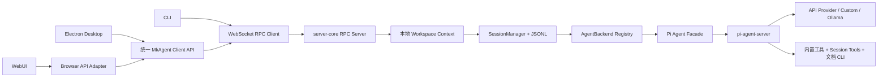

# mkagent MVP 开发计划

> 2026-07-30 边界修订：本文保留最初 MVP 决策的历史记录。当前实现已恢复 ChatGPT Plus 与 Claude Pro/Max 两种 Craft LLM OAuth 流程，但 agent backend 仍仅注册 Pi；Claude Agent SDK、GitHub Copilot 与 Sources/MCP 继续排除。当前边界以 [`README.md`](./README.md) 与 [`migration-features.md`](./migration-features.md) 为准。

> 状态：第三版，产品边界已确认，可按阶段进入实施
> 上游基线：`craft-agents-oss` `v0.11.2` / `a60ebc1a5a7c`
> 产品域名：`mkagent.app`

## 1. 目标与实施原则

mkagent 是一个从新 Git 仓库开始建设的跨平台本地 Agent 产品。它复用 craft 已验证的技术栈、分层架构、代码风格、UI 组件和桌面交互，但不继承其产品身份、线上服务和历史运行数据。

本计划采用“固定基线迁移 + 明确保留闭包 + 明确删除闭包”的方式：

1. 使用 Bun monorepo、Electron、React/Vite/Tailwind、WebSocket RPC、共享 renderer、headless server、CLI、Pi 子进程、JSONL 会话和 `electron-builder`，整体分层与 craft 对齐。
2. 建立全新的 Git 历史、`@mkagent/*` 包名、`MKAGENT_*` 环境变量、`mkagent://` 协议、应用标识和 `~/.mkagent` 数据目录；保留 Apache-2.0 许可证及 NOTICE 归属。
3. Agent backend 保留可插拔接口、注册表和 factory，但首版注册项只有 Pi Agent。以后增加 backend 时不需要重写 SessionManager、RPC 或 UI。
4. Desktop、WebUI、CLI 使用同一个 `server-core + protocol + SessionManager + Pi` 内核；Desktop 与 WebUI 复用同一个 React renderer。
5. 保留 craft 的主要 Agent 工作台能力。真正删除的是 Claude backend、订阅/OAuth、外部 Messaging、产品 Automations、labels、用户自定义 status、projects、kanban、sources、MCP、Viewer/公开分享/远程 workspace、图片生成。
6. 保留 Skills、mini chat、计划提交与审核、annotations/follow-up、Browser、`web_search`、`web_fetch`、附件、文档工具、富 Markdown、会话工具、权限、网络代理、自动更新和完整测试体系。
7. 实现按模块和技术层循序推进；一个模块完成实现、测试、文档和残留扫描后提交一次，不做一个覆盖全仓且难以审查的大提交。
8. 源码和普通注释中尽量不出现 craft/Craft Agent。上游关系只在 `README.md`、`NOTICE`、许可证和 `docs/upstream-sync.md` 等核心文档中说明。
9. 对保留模块沿用 craft 的目录、文件、export、类型、函数和测试命名；只修改包 scope、环境变量、数据目录、协议、产品显示名、图标、域名等品牌专属标识，不为相同职责自创 DTO、adapter、manager、service 或 wrapper。

## 2. 已核验的参考基线

### 2.1 参考仓库职责

| 项目 | 核验提交 | 本计划中的用途 |
| --- | --- | --- |
| craft | `a60ebc1a5a7c` / `v0.11.2` | 唯一架构、技术栈、UI 和功能实现基线 |
| echo | `fc38d0d49166` | 参考在主架构上增加产品模块的方式；Connectors 不进入 MVP |
| xagent | `59d1fdf20b16` | 参考物理删除 Claude/Messaging/MCP、品牌替换、图标生成、默认 workspace 修复 |
| mkagent | 新目录 | 新 Git 历史和实现落点 |

参考仓库只读。craft、echo 当前已有用户修改，后续不得修改、清理或覆盖。

### 2.2 craft 的关键架构事实

- Bun workspace 使用 `apps/*`、`packages/*` 和 hoisted linker。
- Desktop 为 Electron；renderer 使用 React 18、Vite、Tailwind CSS 4、Jotai、Radix UI、Lucide 和 `react-resizable-panels`。
- Electron 主进程内嵌 WebSocket RPC server；preload 和 WebUI adapter 都实现同一 Client API。
- WebUI 直接加载 Electron renderer 的 `App`，不是独立重写的一套页面。
- CLI 是同一 RPC 的客户端，可连接已有 server，也可启动一次性 headless server。
- `server-core` 负责 transport、RPC、SessionManager 和运行时；Pi 在独立 `pi-agent-server` 子进程运行。
- 会话持久化为 JSONL，Pi 恢复数据位于会话目录的 `.pi-sessions`。
- Electron 已有 macOS arm64/x64、Windows x64、Linux x64 构建目标。
- craft 已包含 `electron-updater`、Sentry 接入、Browser pane、文档 CLI/uv、Skills、计划审核和 annotation 组件。

### 2.3 xagent 中需要复用的经验

- Claude 物理删除参考 `3243af6c`、`d194ee47`、`a00108d4`：必须同时处理 driver、factory、runtime、OAuth、UI、测试、依赖和打包资源。
- Messaging 删除参考 `9376eae8`；session MCP 删除参考 `7ca00320`。
- 品牌图标参考 `7e9767f52` 的图标源文件、生成脚本和全平台图标集合；仅复用这些图标相关内容，不复制 xagent 的其他图片、文档、代码或产品资源。
- 品牌路径修复参考 `fec718151`、`0f0d97e85`、`347fbfd54`、`bbf7eb01b`。mkagent 必须先集中路径常量，再批量替换和扫描，避免多轮补漏。
- 默认 workspace 参考 `0e8e0b618`、`e57300a2f`、`bf3bb841d`，同时覆盖 desktop、headless server、窗口恢复和测试。

## 3. MVP 产品范围

### 3.1 必须交付

- Desktop：macOS、Windows、Linux 可开发、构建、安装和自动更新。
- WebUI：由本地 headless server 托管，通过 WebSocket RPC 使用共享 renderer。
- CLI：支持连接已运行 server，以及临时启动本地 server 的一次性运行模式。
- Pi Agent：唯一 backend，实现流式输出、thinking、工具、权限、错误、取消和恢复。
- 模型连接：无订阅、无 OAuth；支持 Pi 已有 provider 的 API key 配置、自定义 endpoint、手工模型和 Ollama 本地模型。
- 会话：新建、选择、继续、搜索、重命名、删除、flag、archive、未读、导入/导出、分支、多窗口和恢复。
- Workspace：本地多 workspace，默认 workspace 为 `default`；支持创建、切换、设置、删除、窗口绑定和数据隔离。
- Skills：功能和交互先与 craft 对齐，包括 mini chat 辅助创建/编辑。
- Agent UI：三栏、可调宽度、亮暗主题、模型选择、附件、计划审核、annotations、工具和富结果渲染。
- Browser：保留右上角 Browser 入口、browser pane/toolbar 及其运行管理。
- 工具：基础文件/终端工具、`web_search`、`web_fetch`、Browser、session tools 和文档工具。
- 设置：整体沿用 craft 的设置导航、页面、RPC 和组件。MkAgent 保留功能在 craft 中已有设置入口时同步保留，对应至少包括 Connections、模型、权限、网络代理、Workspace、外观、语言、更新及必要的高级设置；删除功能的设置入口同步删除。
- i18n：首版只维护英文和简体中文，两种语言必须覆盖核心流程。
- 工程质量：对齐 craft 的 lint、typecheck、单元测试、协议测试、文档工具 smoke test、构建测试和跨平台 CI，并补充 mkagent 特有的裁剪/品牌测试。

### 3.2 明确删除

- Claude Agent SDK、Claude backend、Claude runtime/binary 和 Claude 兼容迁移代码。
- 所有消费者订阅/OAuth 登录，包括 ChatGPT Plus/Pro、GitHub Copilot 和 Claude 订阅。
- 外部 Messaging：gateway、Telegram、WhatsApp、Lark 等渠道、绑定 UI、worker 和打包资源。
- 产品 Automations：scheduler、automation 配置、任务编排页面和对应运行时。自动化测试不属于此删除项。
- 会话 labels、用户可配置 status、Projects 和 Kanban。运行中、等待授权、失败等技术状态保留。
- Sources、API Source、MCP Source、MCP pool、session MCP server、bridge MCP server 和相关 OAuth。
- Viewer app、公开分享页、session transfer 和连接远程 server/workspace。
- 图片生成模型及 `gen_image` 工具。图片附件、图片预览和 `img-tool` 文档/媒体处理仍保留。
- echo Connectors 和 xagent 的 xweb、local llama、专家、团队、沙箱等产品扩展。

### 3.3 特别保留，禁止误删

- 页面内 mini chat、`EditPopover` inline chat、mini model、`mini_completion`、标题和摘要生成。
- `submit_plan`、Plan Review、接受/修改/拒绝计划的暂停与恢复流程。
- 消息 annotations、选区标注、annotation follow-up 及对应 TurnCard/Markdown 交互。
- PDF、DOCX、XLSX、PPTX、图片、iCal、doc diff、MarkItDown、data table 等处理和渲染能力。
- `uv` 和各平台文档 CLI wrapper。
- Browser pane/toolbar、Browser session 管理、`web_search` 和 `web_fetch`。
- 网络代理、权限设置、Workspace 设置、附件、自动更新和未读提示。

## 4. `views` 的定义与暂定处理

craft 的 Views 是“可保存的动态会话筛选器”，不是新的页面布局。每个 View 保存到 workspace 的 `views.json`，通过 Filtrex 表达式匹配会话，例如：

- `hasUnread == true`：未读会话；
- `hasPendingPlan == true`：等待计划审核；
- `isProcessing == true`：正在运行；
- `permissionMode == "safe"`：探索/只读权限。

它也能按 labels/status 过滤，但并不依赖它们。mkagent 保留 Views 的共享类型、存储、表达式校验和 evaluator，只允许使用仍存在的字段；删除 labels/status 条件和默认项。MVP 不在左栏增加 Views 菜单，也不开放自定义 View 的创建/编辑，只在中间会话列表顶部提供“未读、待审核计划、运行中、已归档”等内置筛选。底层 schema 保留，方便后续再开放自定义能力。

## 5. 目标 monorepo

```text
mkagent/
├── apps/
│   ├── electron/              # Desktop 主进程、preload、共享 renderer
│   ├── webui/                 # 浏览器启动壳和 API adapter
│   └── cli/                   # RPC CLI
├── packages/
│   ├── core/                  # 稳定 DTO、AgentEvent、错误码
│   ├── shared/                # 配置、Agent、会话、Skills、主题、i18n
│   ├── ui/                    # UI primitive、Chat、Markdown、文档渲染
│   ├── server-core/           # RPC、SessionManager、运行生命周期
│   ├── server/                # 独立 headless server
│   ├── pi-agent-server/       # Pi SDK 隔离子进程
│   └── session-tools-core/    # 经裁剪的会话级工具定义和 handler
├── scripts/                   # dev/build/package/rebrand/upstream audit
├── docs/                      # 架构、功能、开发、发布和上游同步文档
├── .github/workflows/         # validate/package/release/upstream monitor
├── package.json
├── bunfig.toml
├── bun.lock
├── tsconfig.base.json
├── LICENSE
├── NOTICE
└── README.md
```

不创建 `apps/viewer`、`messaging-*`、`session-mcp-server`。文档脚本作为 Electron resources 保留，不需要新建独立 workspace。

## 6. 运行架构与共享边界



### 6.1 Desktop

- 主进程内嵌只监听 `127.0.0.1` 随机端口的 RPC server。
- preload 使用 `WsRpcClient` 和共享 channel map 构造 craft 现有的 `window.electronAPI`，不因品牌迁移重命名通用 Client API。
- renderer 只依赖统一 Client API，不直接访问 Node/Electron 内部实现。
- 保留多窗口和每窗口 workspace/session 状态恢复。
- 保留原生菜单、文件选择、通知、主题、更新、Browser 和必要系统能力。

### 6.2 WebUI

- Vite 静态资源由本地 `packages/server` 同源托管。
- Browser adapter 实现与 preload 相同的 API；不适用的桌面能力明确 no-op 或返回 capability unavailable。
- 直接复用 Electron renderer 的 App、Chat、Skills、Settings 和 Browser 组件，不复制第二套 UI。
- MVP 面向本机/局域网自托管，不提供远程 workspace federation。非 localhost 访问仍要求鉴权和 TLS 安全提示。

### 6.3 CLI

首版命令与 craft 对齐后按删除项收口，至少包括：

```text
mkagent run <prompt>
mkagent workspaces ...
mkagent sessions [--search] [--archived]
mkagent session create|messages|rename|delete|flag|archive
mkagent session export|import|branch
mkagent send <session-id> <message>
mkagent cancel <session-id>
mkagent connections
mkagent config validate
mkagent ping
mkagent health
```

- `run` 可临时启动本地 server；`--url/--token` 可连接已运行的本地 server。
- `--workspace` 选择 workspace，未指定时使用 `default`。
- `--json` 输出稳定事件；普通模式输出文本、thinking、tool、plan、permission 和完成状态。
- 删除 Sources、Automations、Messaging、Projects、远程 workspace transfer 相关命令。
- 保留所有面向工程的验证命令；不得把产品 Automations 的删除误写成“不保留自动化验证”。

## 7. Pi-only 与模型连接

### 7.1 可扩展 backend，首版只有 Pi

- 保留通用 `AgentBackend`/facade 接口、capability 描述、backend registry 和 factory。
- registry 首版只注册 `pi`；自定义 provider 和 Ollama 都由 Pi 执行，不形成新 backend。
- SessionManager、协议和 UI 不写死 `if pi` 的业务分支，而是读取 backend capability；只有 Pi adapter 内部依赖 Pi SDK。
- 删除 Claude adapter、事件转换、runtime resolver、OAuth 和旧配置迁移。

### 7.2 无订阅、无 OAuth

- 订阅和 OAuth 采用物理删除，不允许通过 feature flag 隐藏后继续保留死逻辑。
- 设置页不显示“绑定订阅”“登录/退出”或 consumer plan 文案。
- 删除 ChatGPT/Codex OAuth、Copilot OAuth、Claude OAuth 的 route、handler、token refresh、凭证类型、connection authType、deep link、callback server、事件、状态、UI、i18n、测试、依赖和打包资源。
- 删除仅服务于 subscription/OAuth 的配置迁移、环境变量、日志字段和错误码；新 schema 不接受这些字段，也不为旧配置提供兼容读取。
- 连接主要使用 API key；Ollama 使用无鉴权本地连接。
- 保留 craft 当前 Pi provider catalog/preset 的展示方式，过滤掉只能通过消费者订阅登录的入口。
- 凭证加密存储，不进入 config、日志、崩溃上报、会话 JSONL 或导出包。
- 删除模块完成时执行一次性源码搜索、依赖检查、typecheck 和构建检查，确认 OAuth/subscription 不再被引用；不增加永久关键词扫描或不存在 route 的专门测试。

### 7.3 Provider 与自定义模型

- 设置页包含连接列表、新增/编辑/删除、测试连接、模型同步、手工模型、默认连接和网络代理。
- 自定义 endpoint 同时支持 `openai-completions` 与 `anthropic-messages` 两种协议。
- Ollama 提供本地 preset：默认 base URL、无 API key、模型探测和手工模型回退。
- provider preset 初始尽量与上游一致；后续由上游同步流程跟踪新增 Pi provider。
- 会话开始前可以选择连接、模型、thinking level；首条消息后是否允许切换按 craft 当前行为保持一致。

### 7.4 Pi 子进程

- 保留 `init/prompt/abort/set_model/set_thinking_level/permission_response/event` 等子进程协议。
- 每个 mkagent session 在自身目录维护 `.pi-sessions`，支持重启续聊。
- 工具同时加入 `customTools` 实例和 `tools` 名称 allowlist，并用回归测试锁定这一契约。
- 保留 mini model、`mini_completion`、标题、摘要和 Skills mini chat 所需的内部模型调用。

## 8. 工具、Browser、文档和权限

### 8.1 基础与 Web 工具

- Pi 基础工具：`read`、`bash`、`edit`、`write`、`grep`、`find`、`ls`。
- Web 工具：`web_search`、`web_fetch`。
- Browser：保留 session tool、BrowserPaneManager、右上角入口、pane、toolbar、页面状态和必要的 CDP/浏览器运行依赖。
- 附件：保留选择、粘贴、拖放、持久化、发送、恢复和安全校验。
- 不保留 `gen_image`；不因此删除图片附件、Markdown 图片或 `img-tool`。

### 8.2 `session-tools-core`

保留该 package 作为 Claude/Pi 无关的单一工具定义和 handler 层，并按能力拆分：

- 保留：`submit_plan`、`skill_validate`、`mermaid_validate`、裁剪后的 `config_validate`、`call_llm`、`update_preferences`、`transform_data`、`script_sandbox`、Browser tool、`get_session_info`、`list_sessions`，以及分支/后台会话流程实际需要的会话工具。
- 保留但去品牌：所有描述、错误、Git trailer 默认值和示例改成 mkagent。
- 删除：`source_test`、所有 Source OAuth/credential handler、`render_template` 的 Source 模板实现、`set_session_labels`、`set_session_status`、外部 Messaging channel 工具。
- Projects/Kanban 对应的 `create_task` 删除；若分支或后台 session 需要 spawn 能力，建立不含 project/source/label 参数的轻量 session spawn schema。
- `config_validate` 只校验仍存在的 config、preferences、permissions、workspace、views 和 tool-icons，不再接受 sources/statuses/automations target。

这里的“外部 Messaging”与 Agent 在本地会话之间的协调不是同一概念。保留分支/后台会话实际需要的精简 `send_agent_message` 和 spawn session 能力，但去掉 Projects、Sources、labels、用户 status 和外部 Messaging channel 参数，不得带回 Messaging gateway。

### 8.3 文档工具链

完整保留并改名以下资源、wrapper、权限和 smoke tests：

- `markitdown`；
- `pdf-tool`；
- `xlsx-tool`；
- `docx-tool`；
- `pptx-tool`；
- `img-tool`；
- `ical-tool`；
- `doc-diff`；
- Python scripts、跨平台 shell/cmd wrapper、`uv` runtime 和按需依赖缓存。

保留 PDF/Office/图片/日历的附件识别、转换、产物链接、Markdown 展示、data table、spreadsheet、document overlay、diff 和下载。为每个平台验证 wrapper 路径、可执行权限、空格路径和首次依赖安装失败提示。

### 8.4 权限与代理

- 权限模式和设置 UI 与 craft 对齐，保留 Explore/Safe、Ask、Execute/Allow-all 的显示映射和底层值。
- 文档只读命令、文件写入、shell、Browser、网络访问分别进入权限规则；删除 Source/MCP 规则。
- 默认模式使用上游当前安全默认值；升级时必须通过权限回归测试。
- 保留应用网络代理设置，覆盖 provider 请求、Web 工具、Browser 和更新检查；敏感代理凭证加密保存并在日志中脱敏。

## 9. Workspace、会话与存储

### 9.1 集中路径定义

所有路径通过一个共享模块生成，禁止散落硬编码：

```text
~/.mkagent/
├── config.json
├── credentials.enc
├── preferences.json
├── themes/
├── logs/
└── workspaces/
    └── default/
        ├── config.json
        ├── permissions.json
        ├── views.json
        ├── skills/<slug>/SKILL.md
        └── sessions/<session-id>/
            ├── session.jsonl
            ├── attachments/
            ├── data/
            ├── long_responses/
            └── .pi-sessions/
```

- 默认覆盖变量为 `CONFIG_DIR`；文档 CLI 使用 `MKAGENT_UV`、`MKAGENT_SCRIPTS` 等统一前缀。
- 不读取或迁移 `~/.craft-agent`、`~/.xagent`，避免污染已有应用数据。
- 默认 workspace 的稳定 slug 是 `default`，显示名默认 `Default`/`默认`；Desktop 和 Server 首次启动都调用同一 `ensureDefaultWorkspace()`。
- 默认 workspace 必须在 config 不存在、索引损坏、无 workspace、headless 启动和多窗口恢复场景都有测试。

### 9.2 本地多 Workspace

- 支持创建、切换、删除、Workspace 设置、每窗口绑定、会话/Skills/权限/Views 隔离。
- MVP 保留 Workspace 创建和切换 UI，方便开发测试；未来只通过产品配置隐藏入口，不删除 service、RPC、schema 或测试。
- 不支持连接远程 server workspace、workspace federation 或 transfer。

### 9.3 会话能力

- Header 保留 id、name、时间、working directory、connection/model、permission、token usage、Pi resume、flag、archive、unread、技术状态和分支关系。
- 删除 labels、用户 status、project、source、automation 字段。
- 支持新建、继续、搜索、重命名、删除、flag、archive/unarchive、未读/read、导入/导出、分支和多窗口。
- 默认会话列表按 `lastUsedAt` 倒序，可按日期视觉分组；不使用可展开的 status/label 菜单组。
- 导入必须生成真实可打开、可继续的本地 session；导出需排除凭证并明确附件处理策略。
- 技术状态保留 idle/processing/waiting-permission/failed/interrupted 等，用于列表状态点、未读和恢复。

## 10. UI 与交互

### 10.1 三栏布局

```text
┌──────────────────┬────────────────────────┬────────────────────────────────────┐
│ 左侧菜单         │ 中间列表/导航          │ 右侧内容                           │
│ + 新建会话       │ 搜索与筛选             │ 会话 Header / Browser 入口         │
│ Workspace 控件   │ 会话列表               │ 消息、计划、annotations、工具结果  │
│ 会话             │ 或 Skills 列表         │ 或 Skill / Settings 详情           │
│ Skills           │ 或 Settings 导航       │ 输入、附件、模型、权限、发送/停止  │
│ 设置             │                        │                                    │
└──────────────────┴────────────────────────┴────────────────────────────────────┘
```

- 左栏业务菜单只保留“会话、Skills、设置”，顶部保留“新建会话”；不显示 status/label/project 展开组。
- Workspace 控件暂时位于与上游相同或相近的顶部区域，未来可隐藏。
- 中栏显示会话列表、Skills 列表或 Settings 导航；会话列表支持搜索、archive 和必要的 Views 筛选。
- 右栏显示 Chat、Skill 详情或设置详情；Chat header 保留模型/连接和 Browser 入口。
- 左栏和中栏宽度可拖动并持久化，保留 min/max、双击恢复和窄屏 compact 行为。
- 保留上游 panel、radius、gap、阴影、排版、颜色 token、hover/focus、toast 和键盘交互。
- 主题保留 `light/dark/system` 及上游 preset 机制；首版内置主题数量跟随上游。

### 10.2 Chat、计划与 annotations

- 保留 event processor 的 text、thinking、tool、permission、plan、annotation、error、complete、interrupted 事件。
- 保留 `TurnCard`、`UserMessageBubble`、`InlineExecution`、Plan Review、annotation overlay/island、follow-up 和选择恢复。
- `submit_plan` 后暂停执行，用户接受、要求修改或拒绝后恢复，Desktop/WebUI 行为一致。
- 保留 Markdown/GFM、代码、diff、terminal、Mermaid、数据表、文档 overlay、PDF/Office/图片等富结果渲染。
- 只删除外部 Messaging activity，以及 labels/status/projects/sources/automations 专属 activity。

### 10.3 Mini chat 与 Skills

本轮决定改为：mini chat 先完整保留，简化 MVP 迁移并与上游对齐。

- 保留 `EditPopover` inline chat、compact ChatDisplay、mini model 选择和内部 mini completion。
- Skills 保留三层发现：全局 `~/.agents/skills`、workspace `skills`、项目 `.agents/skills`，优先级为 global < workspace < project。
- 保留 `SKILL.md`、frontmatter、列表/搜索/详情/文件树、打开外部编辑器、导入、删除、图标缓存、文件 watcher、picker/mention 和 prompt 注入。
- 新建/编辑 Skills 的 agent-native mini chat 交互与 craft 对齐，不改成普通表单替代。
- Sources 删除后，移除或忽略 `requiredSources` 语义，并增加兼容提示和测试，不能因此破坏普通 Skill。

### 10.4 设置与 i18n

设置页至少保留：

- Connections / Models；
- Permissions；
- Network Proxy；
- Workspaces；
- Appearance / Theme；
- Language；
- Updates；
- 必要的 Advanced/Logs。

只提供 `en` 和 `zh-Hans`。新增文案不得直接写死在组件中；构建阶段检查两种 locale 的 key 一致性。删除功能对应的翻译 key 同步删除。

## 11. 品牌、标识和可再次派生的替换机制

### 11.1 单一事实源

沿用 craft/xagent 已有的共享 `branding.ts`、config path 模块和构建配置，集中维护：

- `productName`: `mkagent` / `MkAgent`；
- npm scope: `@mkagent/*`；
- domain: `mkagent.app`；
- URL scheme: `mkagent://`；
- environment prefix: `MKAGENT_`；
- config directory: `.mkagent`；
- executable/CLI name、Electron appId、desktop file、协议 handler；
- 图标源文件和生成目标。

不新增一套与上游平行的产品 manifest 或同义抽象。未来基于 mkagent 派生产品时，按固定的品牌提交序列修改已有 branding/path/build 文件，并执行一次性残留检查。

### 11.2 固定的品牌提交序列

品牌迁移必须拆成连续、可 cherry-pick、可审查的提交：

1. `chore: initialize upstream baseline and notices`：新 Git、LICENSE、NOTICE、上游记录。
2. `chore: establish mkagent branding and paths`：在既有 branding/path 模块集中产品常量。
3. `chore: rename package scope protocols and environment`：包名、CLI、协议、`MKAGENT_*`。
4. `chore: migrate data roots to ~/.mkagent`：路径模块、wrapper、日志、测试；一次性完成且不提供旧目录双读。
5. `feat: install mkagent brand assets`：基于 xagent logo 源和生成脚本生成 Electron/WebUI 全平台图标。
6. `chore: configure mkagent.app metadata and links`：homepage、帮助、更新和发布 metadata。
7. `chore: create default workspace`：统一 `default` workspace bootstrap 和测试。
8. `chore: complete one-time rebrand cleanup`：执行一次性源码与产物检查并记录结果，不加入长期 CI。

允许残留 `craft` 字样的范围只包括 LICENSE/NOTICE、README 的来源说明、`docs/upstream-sync.md` 和专门的上游补丁记录。普通源码、注释、环境变量、默认路径、包名、协议和产物中均不允许。

## 12. 构建、打包、更新与 Sentry

### 12.1 开发和构建目标

```text
bun install
bun run electron:dev
bun run electron:start
bun run webui:dev
bun run server:dev
bun run server:dev:webui
bun run cli -- <command>
bun run validate:dev
bun run validate:ci
```

产物：

- macOS arm64/x64：DMG + ZIP；
- Windows x64：NSIS；
- Linux x64：AppImage；
- Headless server：对应平台 standalone binary；
- CLI：Bun package/bin，随后补充 standalone binary smoke test。

打包必须包含 Pi server、Bun runtime、ripgrep、Browser 依赖、文档 wrappers/scripts、uv、默认 permissions/docs/themes/tool icons 和许可证；删除 Claude、Messaging、MCP、Viewer 和图片生成资源。

### 12.2 自动更新

- 保留 craft 的 `electron-updater` 状态机、检查/下载/进度/安装/退出恢复和多窗口快照逻辑。
- 源码与 release 产物统一存放在 public `MkThingsHQ/mkagent`。
- private 仓库的 GitHub Actions 构建签名后的安装包、`latest*.yml`/blockmap/checksum，再使用最小权限 secret 发布到 public 仓库。
- Electron updater 使用 GitHub provider，owner 为 `MkThingsHQ`、repo 为 `mkagent`；客户端不包含 PAT、`GITHUB_TOKEN` 或其他长期令牌。
- 客户端只接受匹配平台/架构、签名和 channel 的产物；更新失败不影响正常启动。
- 不使用 `agents.craft.do` 或任何上游更新地址。

### 12.3 Sentry 的现状与处理

craft 确实接入了 Sentry：Electron main 读取 `SENTRY_ELECTRON_INGEST_URL` 作为 DSN，renderer 也初始化 Sentry；未设置该变量时禁用。错误实际上传到该 DSN 所属的 Sentry 项目。仓库中没有固定 DSN，因此仅从代码无法确定 craft 的具体账号或服务器。

mkagent 与 craft 的接入方式保持一致：

- 保留 Electron main、renderer 的 Sentry 初始化、release/environment 信息和 source map 配置能力。
- 继续由 `SENTRY_ELECTRON_INGEST_URL` 控制：未设置 DSN 时禁用，设置后上传到该 DSN 所属项目。
- 只允许配置 mkagent 自有 DSN，不复用任何 craft endpoint/account。
- 上报前按 craft 现有机制做 API key、Authorization、代理凭证和 credential 字段脱敏；不额外新增 Sentry 设置页开关。
- CI 的 source map 上传只读取发布 secret，fork/普通 PR 不上传。

## 13. 文档策略

文档不是整体删除项。迁移后按实际功能逐篇审查：

- 必须保留并改写：README、架构、开发环境、Desktop/WebUI/CLI、Connections/Models、Ollama、权限、代理、Workspace、Sessions、Skills、mini chat、Browser、Web tools、附件、文档工具、计划审核/annotations、主题、i18n、打包、更新、数据目录、故障排查。
- 新增：`docs/upstream-sync.md`、`docs/rebrand.md`、`docs/featues.md`、`docs/testing.md`。
- 删除：Claude、订阅/OAuth、Messaging、Automations、Sources/MCP、Projects/Kanban、Viewer/公开分享、远程 workspace 的用户文档。
- 文档中的命令、截图、路径、域名和 UI 名称必须能由测试或当前实现验证；不复制与现状不符的宣传内容。
- README 可明确说明项目源自 craft 架构并保留许可证归属；普通功能文档使用 mkagent 自身术语。

## 14. 上游自动跟踪与同步

“自动追随 craft”实现为自动发现和生成同步 PR，不直接无审查合并：

1. Git 配置只读 `upstream` remote，并在 `docs/upstream-sync.md` 记录当前基线 commit/tag。
2. GitHub Action 定期检查上游新 tag/main 提交，生成差异报告和候选同步 PR。
3. 差异按模块分类：构建依赖、协议/server、Pi/provider、UI、Skills/mini chat、Browser/Web tools、文档工具、跨平台打包、测试、安全修复。
4. 明确拒绝的功能目录进入 denylist；同步脚本不自动带回 Claude、订阅、Messaging、Automations、Sources/MCP 等闭包。
5. 每类改动独立提交，先更新适配层和测试，再同步 UI；不得用整仓 merge 覆盖 mkagent 产品边界。
6. 每次同步运行完整的现有工程测试和安装包 smoke test；同步审查中按实际差异检查是否重新带回已删除功能，不建立永久关键词扫描。

这样既能持续跟随上游，又保持新 Git 历史和可审查的产品差异。

## 15. 分阶段实施与提交纪律

### Phase 0：基线、Git 与法律归属

- 初始化新 Git；固定上游 commit；建立 LICENSE、NOTICE、README 和 feature matrix。
- 建立 upstream remote、同步记录和只读参考约束。
- 完成第 11.2 节前两个品牌提交。

验收：历史从 mkagent 根提交开始；来源和许可证明确；参考仓库无改动。

### Phase 1：Bun monorepo 与品牌/路径

- 按技术栈顺序建立根 workspace、TypeScript、lint、test、Vite/Tailwind 和基础 CI。
- 建立 apps/packages 骨架、既有 branding/path 模块和 `default` workspace。
- 完成品牌提交序列 3—8。

验收：`bun install` 可复现；空骨架可 typecheck/test；`~/.mkagent` 和 `default` 测试通过；一次性品牌检查无非文档残留。

### Phase 2：Core protocol、RPC 与本地 Workspace

- 迁移 DTO、codec、RPC client/server、push、auth、capability 和 reconnect。
- 迁移本地多 workspace、窗口绑定、settings、权限和网络代理协议。
- Desktop embedded server、standalone server、CLI 使用同一 `server-core`。

验收：两个 workspace 可创建/切换/删除并隔离；协议 success/error/reconnect/unknown channel 测试通过。

### Phase 3：会话存储与会话功能

- 迁移 JSONL、SessionManager、附件、长结果、未读、flag/archive、搜索、重命名、删除和技术状态。
- 迁移 import/export、branch、多窗口和恢复。
- 建立裁剪后的 Views evaluator。

验收：全套会话操作在重启后保持；导入会话真实可打开续聊；凭证不进入导出；labels/status/project/source 字段不存在。

### Phase 4：Backend 抽象、Pi 与连接

- 建立 backend interface/registry，仅接入 Pi facade 和 Pi 子进程。
- 迁移 API-key provider catalog、custom endpoint、Ollama、凭证和模型选择。
- 物理删除所有 subscription/OAuth 和 Claude 路径、schema、依赖与资源，并在该模块提交中完成一次性搜索、依赖、typecheck 和构建检查。
- 接通 stream/thinking/tool/permission/error/abort/resume 以及 mini model。

验收：至少一个真实 API-key provider、两种协议的 mock/兼容 endpoint 和 Ollama 完成对话；凭证脱敏；只有 Pi backend 被注册。

### Phase 5：工具、Browser 和文档工具

- 接入基础工具、`web_search`、`web_fetch`、Browser 和裁剪后的 session tools。
- 迁移附件与文档工具、uv、权限规则、富结果数据协议。
- 逐个文档工具执行 upstream smoke tests，再做 packaged-path smoke。

验收：工具注册双清单一致；Browser pane 可打开并操作；Web tools 可返回结果；PDF/DOCX/XLSX/PPTX/图片/iCal/doc diff 的代表流程通过。

### Phase 6：共享 UI、Skills、mini chat、Plan/Annotations

- 迁移设计 token、主题、UI primitives 和三栏 AppShell。
- 实现左栏、中栏、Chat、设置、会话状态、搜索/archive/Views 筛选。
- 迁移 Skills 全功能和 mini chat。
- 迁移 Plan Review、annotations/follow-up、Markdown/文档富渲染。

验收：Desktop/WebUI 共用组件；三栏和主题一致；Skills/mini chat、计划审核、标注、文档渲染端到端通过；删除功能无入口。

### Phase 7：WebUI 与 CLI

- 完成 Browser API adapter、静态托管、本地鉴权和响应式布局。
- 对齐并裁剪 CLI 命令，完成文本/JSON 流和临时 server。

验收：Desktop、WebUI、CLI 操作同一 workspace/session 得到一致结果；CLI 自动化脚本可稳定判断退出码和事件。

### Phase 8：打包、更新、发布与文档

- 迁移并验证三平台打包、签名、公证/安装、更新状态机和 GitHub Releases workflow。
- 按上游方式接入 Sentry；没有 mkagent DSN 的构建自动禁用，配置 DSN 的发布构建完成脱敏和 source map 验证。
- 完成所有用户/开发/架构文档。

验收：三平台 CI 构建；至少各一次安装启动 smoke；更新清单有效；解包资源完整且无拒绝功能/品牌残留。

### Phase 9：质量收口

- 删除死依赖、死 channel、死类型、死翻译和无效文档。
- 完整运行 `validate:ci`、`git diff --check`、许可证/凭证/路径/品牌扫描。
- 输出已通过、未验证和平台限制清单，不以“能构建”替代功能验收。

### 提交规则

- 每个 Phase 再按 package/技术模块拆小提交；一个提交只解决一个可说明、可测试的主题。
- 推荐顺序：基础配置 → core/protocol → shared storage → server-core → Pi → tools → UI → Electron → WebUI → CLI → packaging/docs。
- 每个模块提交前：目标测试、typecheck、lint、`git diff --check`；阶段结束再运行完整验证。
- 不把格式化、品牌替换、功能迁移和删除混进同一个提交。

## 16. 自动化测试与验收矩阵

这里的“自动化测试”全部保留并扩充。删除的 Automations 是产品功能，不是测试手段。

| 层级 | 必测内容 |
| --- | --- |
| Static | format/lint、全 workspace typecheck、locale key、依赖边界、循环依赖 |
| Unit | config/path、default workspace、credential redaction、JSONL、Views、model resolution、Ollama、tool allowlist、Skills、mini completion |
| Protocol | handshake/auth、RPC success/error、push、reconnect、版本不兼容、unknown channel、workspace routing |
| Session | create/send/stream/cancel/resume/search/rename/delete/flag/archive/unread/import/export/branch、多窗口、损坏 JSONL fail-soft |
| Agent | backend registry 只有 Pi、event mapping、权限暂停恢复、计划审核、annotations、Pi session resume |
| Tools | 基础工具、web_search/web_fetch、Browser、session tools、Source/MCP 工具不存在 |
| Docs | 上游全部文档工具 smoke tests、跨平台 wrapper、uv、packaged resources、富结果渲染 |
| UI | 三栏宽度/主题、Workspace、会话列表、技术状态、Skills/mini chat、Plan Review、annotations、附件、模型、权限、Browser |
| WebUI | 同源 WS、鉴权、刷新恢复、响应式、桌面专属 capability 降级 |
| CLI | 本地 run、连接 server、JSON schema、Ctrl-C、超时、错误退出码、脚本化调用 |
| Packaging | mac/win/linux 构建、解包资源、Pi/Bun/uv/ripgrep/Browser、图标、应用 ID、签名、配置目录 |
| Update | manifest、channel、下载校验、安装、失败回退、多窗口恢复、GitHub draft→release |
| Security | 非 localhost 明文限制、路径穿越、凭证/日志/Sentry 脱敏、代理凭证、shell/file 权限 |
| Cleanup | 品牌提交和功能删除提交分别执行一次性源码、依赖与产物检查；不增加长期关键词扫描 |

CI 至少包含：

1. Linux 快速校验：install、lint、typecheck、unit/protocol/session/doc-tools tests。
2. macOS/Windows/Linux 构建矩阵：Electron、Server、WebUI、CLI。
3. 安装包解包和资源定位 smoke。
4. 定期 upstream drift 检查。
5. Release tag 的签名、更新 metadata 和发布验证。

“开发完成”的定义是对应阶段测试通过，并有明确的真实运行证据；不能仅以文件存在、依赖安装成功或安装包生成作为完成。

## 17. 最终确认的实施决策

1. Views 的 MVP 只提供内置筛选，不开放用户自定义编辑；保留底层 schema/evaluator。
2. GitHub 源码、公开安装包与更新 manifest 统一放在 public `MkThingsHQ/mkagent`；客户端不内嵌 GitHub token。
3. Sentry 功能保留并与 craft 接入方式对齐；只有配置 mkagent 自有 DSN 时启用。
4. Electron appId/macOS bundle identifier 暂用 `app.mkagent.desktop`，版权主体和签名账号使用明确标记的中性占位值，正式发布前再替换。
5. 保留分支/后台会话需要的本地 `send_agent_message` 和 spawn session 工具，裁掉 Projects、Sources、labels/status 和外部 Messaging 耦合。
6. Subscription/OAuth 相关逻辑、类型、RPC、UI、deep link、token refresh、依赖、资源和兼容迁移全部物理删除，不允许残留不可达代码。
7. 第 18 节的全部风险控制措施都是必须执行的质量门禁，不是可选建议。

其他已确认边界：只注册 Pi backend；provider preset 跟随上游；支持两种自定义协议和 Ollama；保留 Browser/Web tools/附件/mini chat/Skills/计划/annotations/文档工具/uv/代理/权限/自动更新；保留本地多 workspace；默认 workspace 为 `default`；保留会话 flag/archive/unread/import/export/branch/multi-window；只支持中英文；不支持 Viewer、公开分享、远程 workspace 和图片生成。

## 18. 主要风险与控制

下表控制措施必须进入对应 Phase 的任务清单、测试和验收记录。任一必需控制未完成时，该 Phase 不得标记完成，也不得进入发布分支。

| 风险 | 控制措施 |
| --- | --- |
| 上游同步重新带回已删功能 | feature denylist、依赖扫描、独立同步 PR、模块级提交 |
| Subscription/OAuth 删除不完整 | 物理删除类型/RPC/UI/deep-link/token refresh/迁移/依赖/资源，在对应删除提交中执行一次性搜索、依赖检查、typecheck 和构建检查 |
| 保留丰富 UI 导致误删 Plan/Annotation/Docs | 第 3.3 节作为硬性保留清单；端到端测试锁定 |
| Sources 与 Skills/session-tools 原有耦合 | 移除 `requiredSources`、重建 tool schema、负向注册测试 |
| 文档工具跨平台依赖复杂 | 保留 upstream smoke tests；增加 packaged-path 和 Windows 空格路径测试 |
| Browser 与 WebUI capability 不一致 | 共享接口声明 capability；WebUI 明确降级，禁止静默失败 |
| 品牌/路径多轮补漏 | 既有 branding/path 模块、固定提交序列和一次性源码/产物检查 |
| 自动更新损坏安装或状态 | GitHub draft 验证、签名/校验、channel 隔离、失败回退和多窗口测试 |
| Sentry 泄露会话或凭证 | 无 DSN 自动禁用、严格脱敏、用户开关、自有 DSN、无 secret 的 PR 不上传 |
| 自动追随上游与新历史冲突 | 自动检测/生成 PR，不自动合并；记录基线和补丁映射 |
| 测试数量多拖慢开发 | 模块提交跑目标测试，阶段结束跑完整套件，CI 分快速/跨平台/release 三层 |
